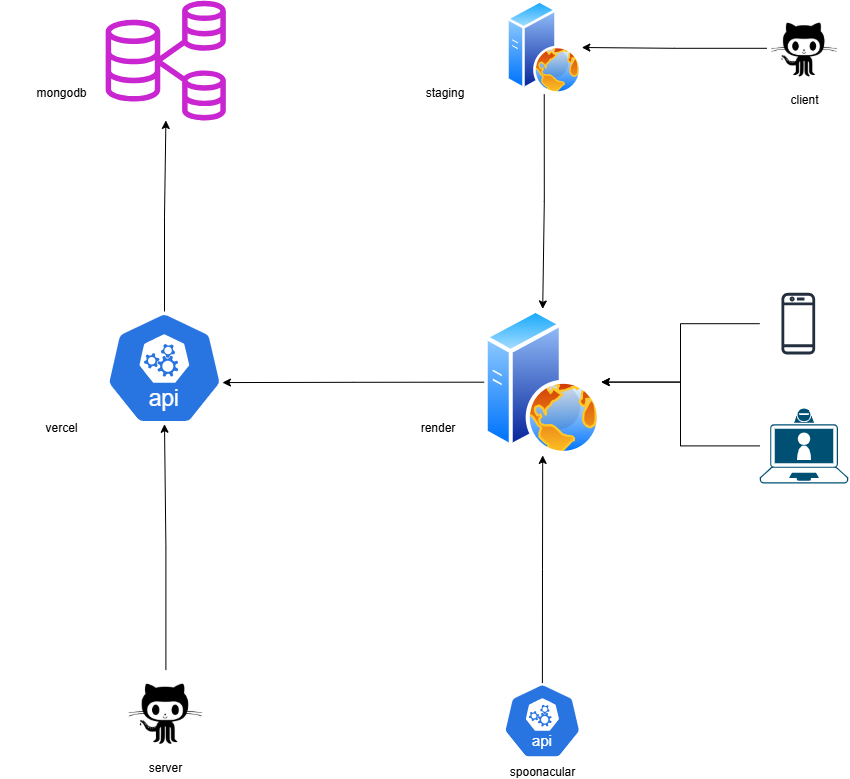

# **PEEBO - Cook With What You Already Have**
PEEBO is a web application that helps users discover recipes based on ingredients they already have at home. It provides a simple and intuitive interface to search for recipes, save favorites, and keep track of cooking notes.




## Features

- **Ingredient-Based Recipe Search**: Find recipes using ingredients you already have
- **Recipe Details**: View comprehensive recipe information including cooking time, servings, instructions, and more
- **Save Favorites**: Save recipes to your personal collection for easy access
- **Personal Notes**: Add your own notes to saved recipes
- **User Authentication**: Secure account creation and login with Firebase

## Tech Stack

### RESTful API Architecture
- Serveless functions stitching 3rd party api with cloud infrastructure

### Frontend
- React.js with Vite
- Chakra UI for responsive design and theming
- Zustand for state management
- React Router for navigation
- Vercel Frontend Hosting

### Backend
- Node.js with Express
- MongoDB Atlas with Mongoose ODM
- Firebase Authentication
- Render Backend Hosting

### External APIs
- Spoonacular API for recipe data

## Getting Started

### Prerequisites
- Node.js (v16 or higher)
- MongoDB
- Spoonacular API key
- Firebase project

### Installation

1. **Clone the repository**
   ```bash
   git clone https://github.com/sprusrxeroxx/PEEBO.git
   cd PEEBO
   ```

2. **Set up environment variables**
   
   Create `.env` in the server directory:
   ```
   MONGODB_URI=your_mongodb_connection_string
   SPOONACULAR_API_KEY=your_spoonacular_api_key
   PORT=5000
   ```

   Create `.env.local` in the client directory:
   ```
   VITE_FIREBASE_API_KEY=your_firebase_api_key
   VITE_FIREBASE_AUTH_DOMAIN=your_firebase_auth_domain
   VITE_FIREBASE_PROJECT_ID=your_firebase_project_id
   VITE_FIREBASE_STORAGE_BUCKET=your_firebase_storage_bucket
   VITE_FIREBASE_MESSAGING_SENDER_ID=your_firebase_messaging_sender_id
   VITE_FIREBASE_APP_ID=your_firebase_app_id
   ```

3. **Install dependencies**
   ```bash
   # Install server dependencies
   cd server
   npm install

   # Install client dependencies
   cd ../client
   npm install
   ```

4. **Start the application**
   ```bash
   # Start the server (from server directory)
   npm start

   # Start the client (from client directory)
   npm run dev
   ```

## Usage

1. **Create an account** or log in with existing credentials
2. **Search for recipes** by entering ingredients you have on hand
3. **Browse recipe results** and view detailed information
4. **Save recipes** to your personal collection
5. **Add notes** to saved recipes with your own cooking tips or modifications

## API Endpoints

### Recipes
- `GET /api/v1/recipes/search?ingredients={ingredients}` - Search for recipes by ingredients
- `POST /api/v1/recipes/save` - Save a recipe to user's collection
- `GET /api/v1/recipes/saved/{userId}` - Get all saved recipes for a user
- `DELETE /api/v1/recipes/saved/{id}` - Delete a saved recipe
- `PATCH /api/v1/recipes/saved/{id}/notes` - Update notes for a saved recipe

### Users
- User authentication is handled via Firebase

## Project Structure

```
PEEBO/
├── client/               # React frontend
│   ├── src/
│   │   ├── components/   # React components
│   │   ├── contexts/     # Context providers
│   │   ├── pages/        # Page components
│   │   ├── store/        # Zustand state stores
│   │   └── theme/        # Chakra UI theme customization
├── server/               # Express backend
│   ├── controllers/      # Route controllers
│   ├── models/           # MongoDB models
│   ├── routes/           # API routes
│   └── services/         # Business logic and services
│       └── enrichers/    # Recipe enrichment modules
```

## Recipe Enrichment Pipeline

PEEBO uses a modular enrichment pipeline to enhance recipe data. This allows for:

- Fetching additional details from the Spoonacular API
- Extending recipe information with custom data
- Adding more enrichment steps without changing existing code

## Credits

- Recipe data provided by [Spoonacular API](https://spoonacular.com/food-api)
- Icons from [React Icons](https://react-icons.github.io/react-icons/)
- UI components from [Chakra UI](https://chakra-ui.com/)

## License

This project is licensed under the MIT License.

## Contributing

Contributions are welcome! Please feel free to submit a Pull Request.
- UI components from Chakra UI

## Future Updates
- Ai based ingredient detection
- Shared user pantries/groceryLists/meals
- Tinder like feel to cooking instruction cards
- Weekly "use it up" snapshots for expirying ingredients

Many more updates coming! Stay tuned.


